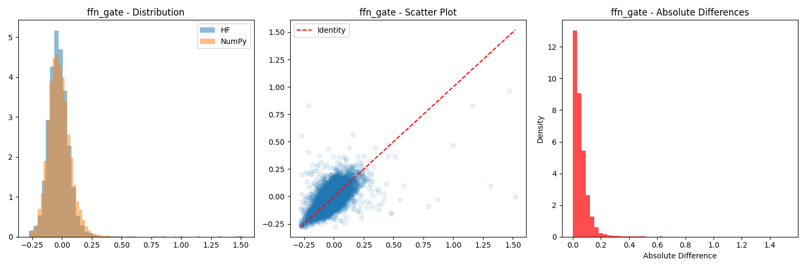
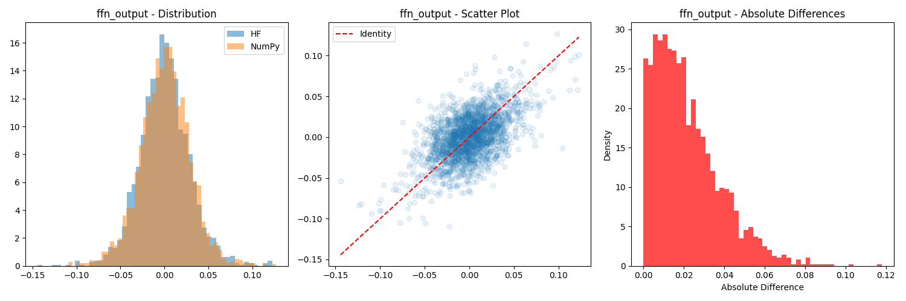
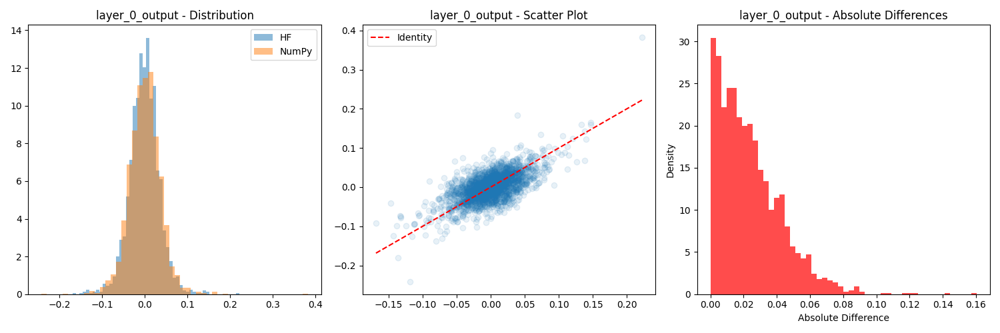
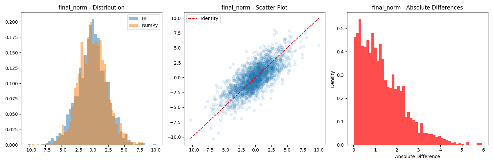
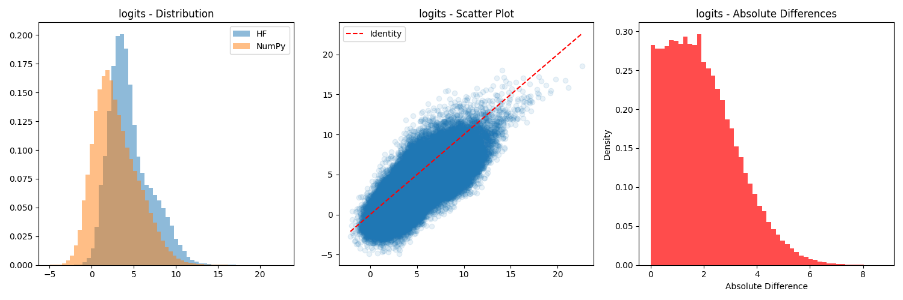

# llama3.npy

This repository contains numpy implementation of the llama 3 model architecture.

## Outputs

- [NumPy Output Log](./outputs/np_20250331_235520.log)
- [Hugging Face Output Log](./outputs/hf_20250331_235335.log)

The following plots compare the internal activations between this NumPy implementation (`llama3.py`) and a reference HuggingFace implementation (`generate_hf.py`) at various stages within the model, using the same input and weights. 
Note that the NumPy implementation may not perfectly match the reference, and these plots visually highlight potential differences in the activations. [WIP]

## Plots

Figure 0: Llama3 arch

  

Figure 1: Embeddings Comparison

Figure 2: First Norm Comparison

Figure 3: Attention Output Comparison

Figure 4: Residual 1 Comparison

Figure 5: Post Attention Norm Comparison

Figure 6: FFN Input Comparison

Figure 7: FFN Gate Comparison

Figure 8: FFN Up Comparison

Figure 9: FFN Down Comparison

Figure 10: FFN Output Comparison

Figure 11: Layer 0 Output Comparison

Figure 12: Final Norm Comparison

Figure 13: Logits Comparison

