# llama3.npy

Figure 1: Embeddings Comparison

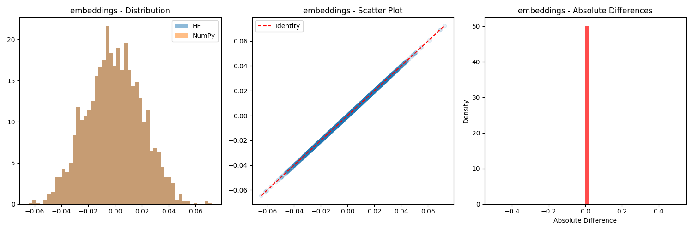

Figure 2: First Norm Comparison

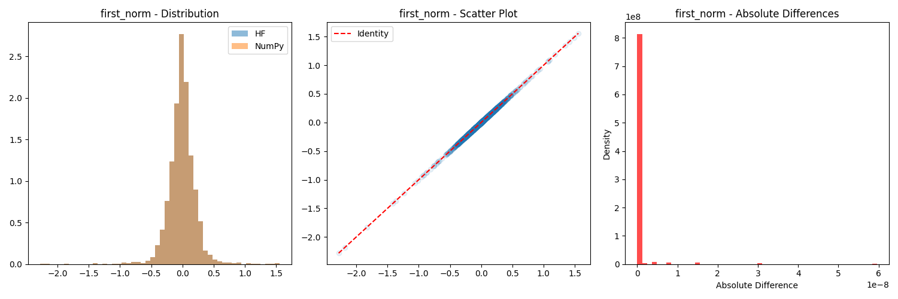

Figure 3: Attention Output Comparison

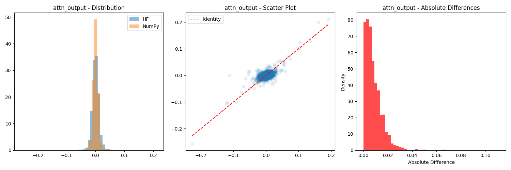

Figure 4: Residual 1 Comparison

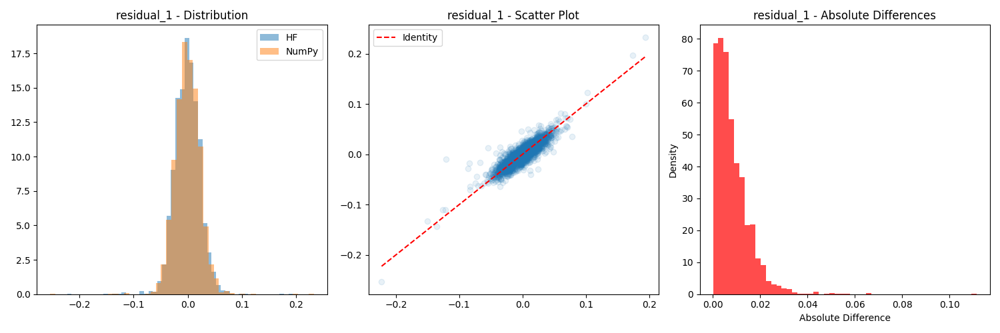

Figure 5: Post Attention Norm Comparison

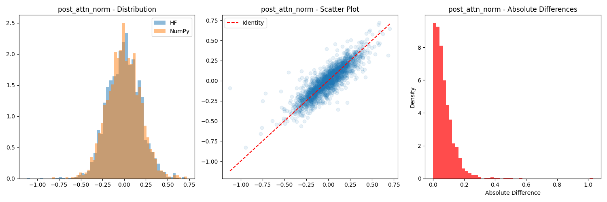

Figure 6: FFN Input Comparison

Figure 7: FFN Gate Comparison

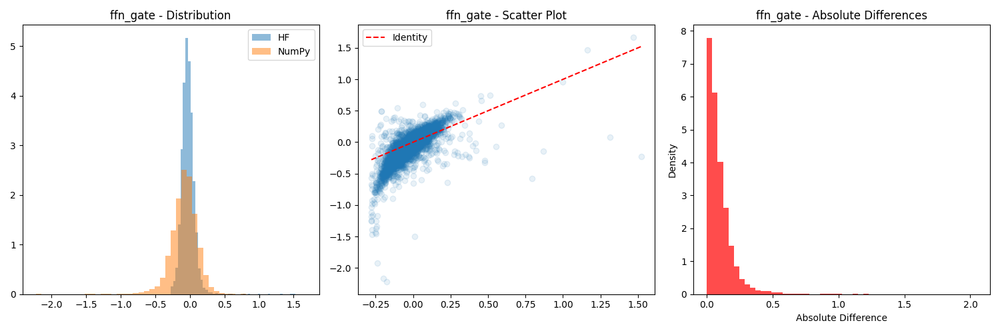

Figure 8: FFN Up Comparison

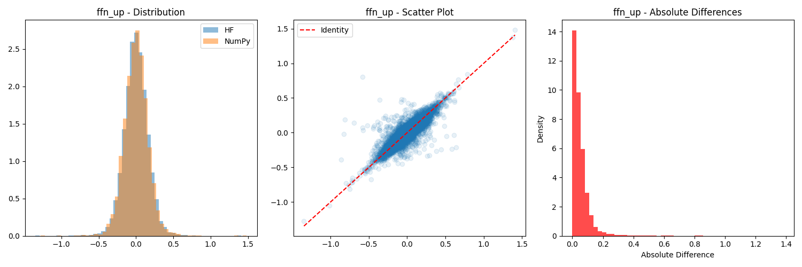

Figure 9: FFN Down Comparison

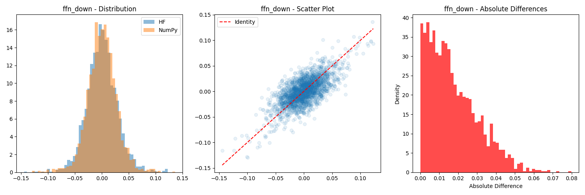

Figure 10: FFN Output Comparison

Figure 11: Layer 0 Output Comparison
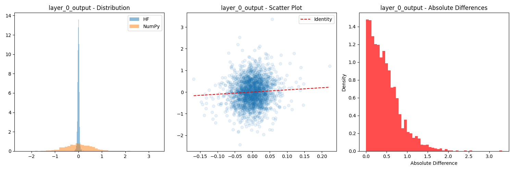

Figure 12: Final Norm Comparison

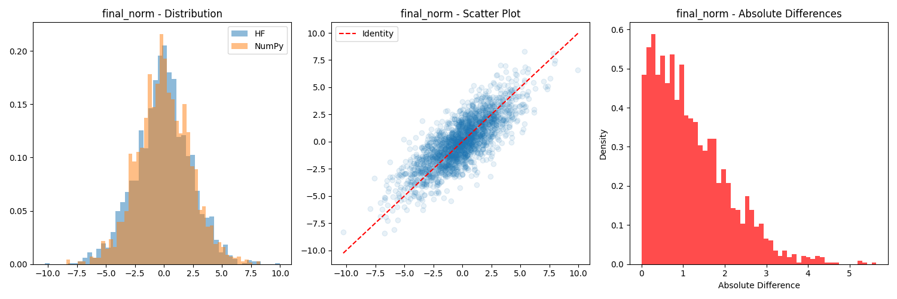

Figure 13: Logits Comparison

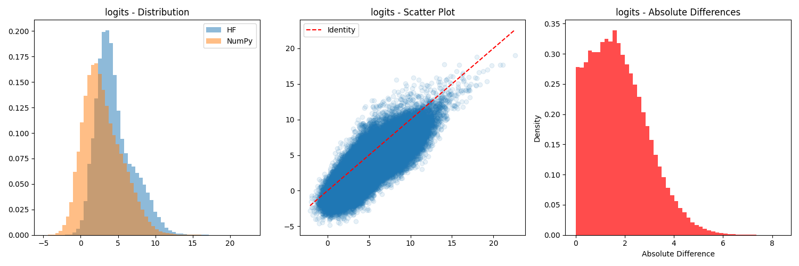
